# HealthGuard - Healthcare Management System

HealthGuard is a full-stack healthcare management system built using **PHP and MySQL**, designed to manage healthcare operations through role-based access for **Admin, Doctor, and Patient**.

> **Status:** Work in Progress – The project is still under active development.

---

##  Features

###  Admin Dashboard

The Admin panel provides full control over the system:

* Manage doctors, patients, and users
* Add and manage illnesses and drugs
* Control system data and relationships
* Access system overview and management tools

---

###  Doctor Dashboard

Doctors can manage their daily workflow:

* View and manage patients
* Handle appointments
* Access medical reports
* View messages and notifications
* Manage nutrition plans

---

###  Patient Dashboard

Patients can interact with the system:

* Search and find doctors
* Book and manage appointments
* View medical reports
* Access personal profile
* View notifications and messages

---

##  Database Design

The system uses a structured MySQL database (`healthguard`) with multiple related tables.

The database demonstrates:

* Relationships between users, doctors, patients, and appointments
* Use of Primary Keys and Foreign Keys
* Organized schema for real-world healthcare systems

---

##  Screenshots

###  Admin Panel

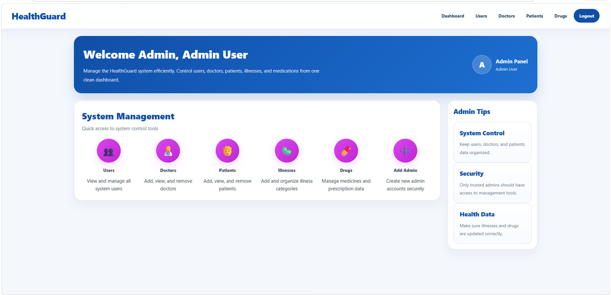
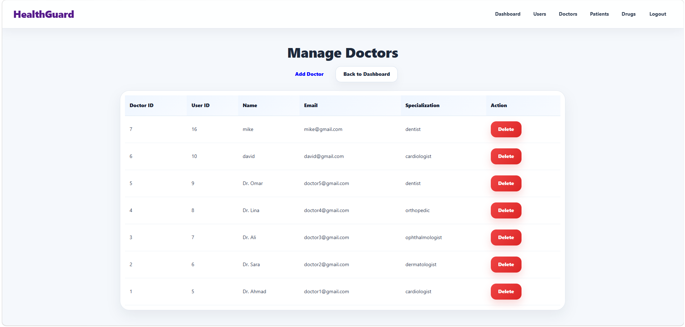
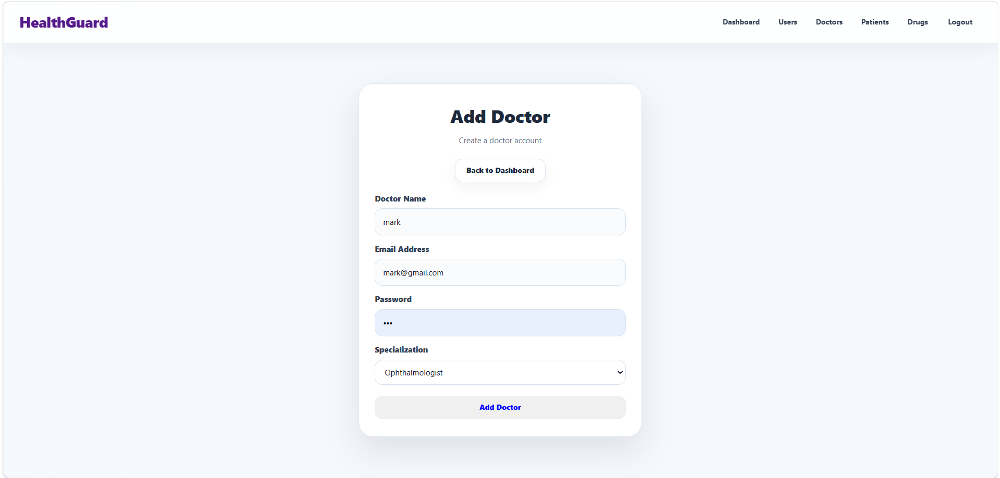
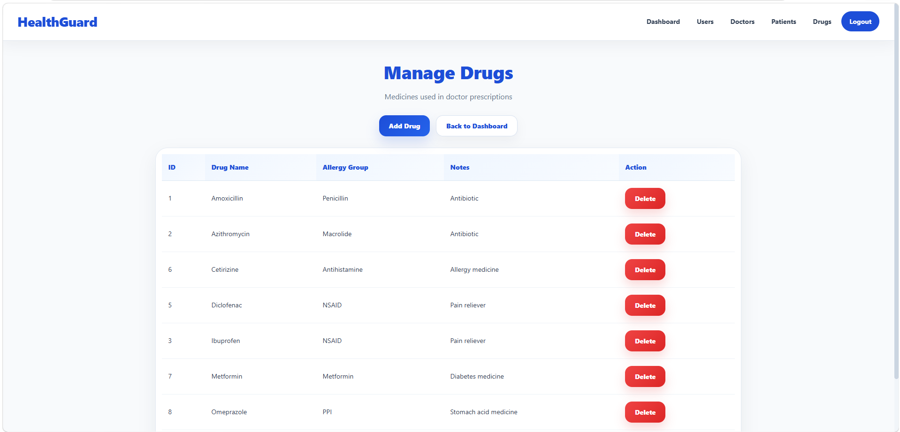
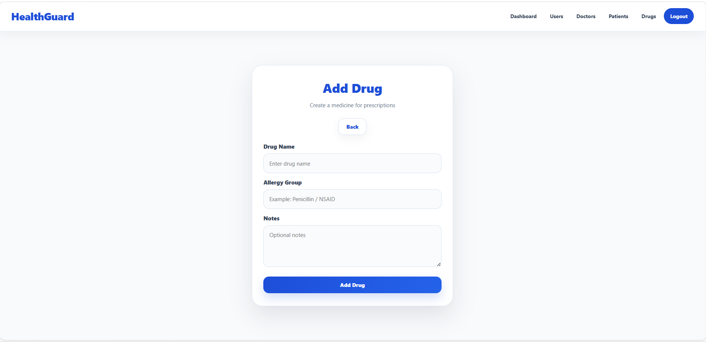
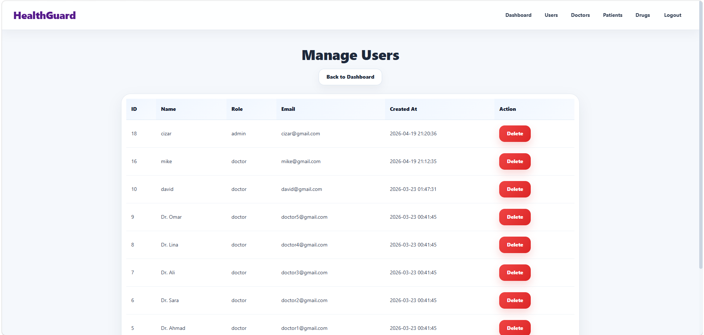

---

###  Doctor Panel

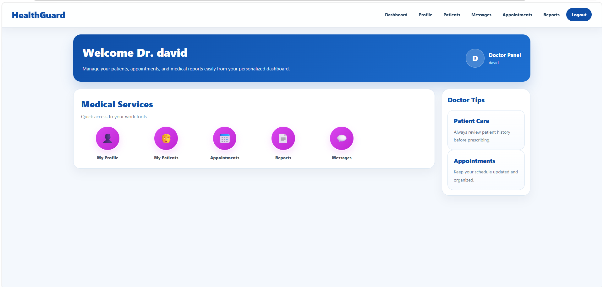
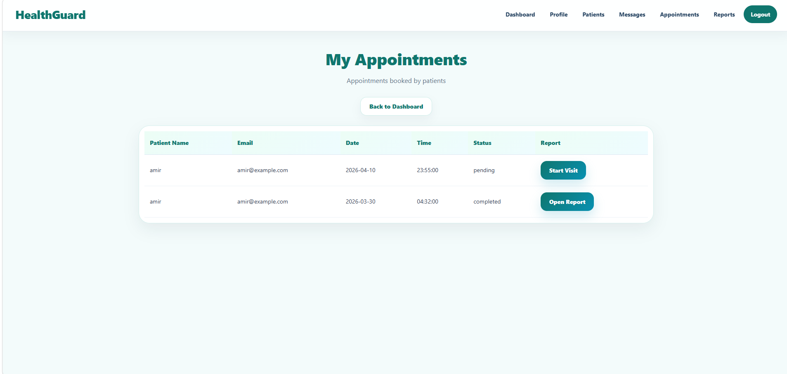
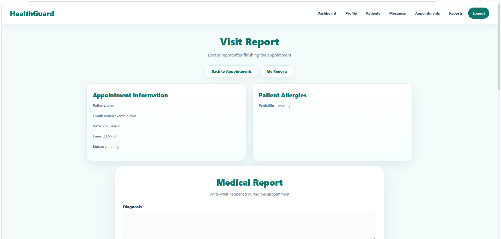
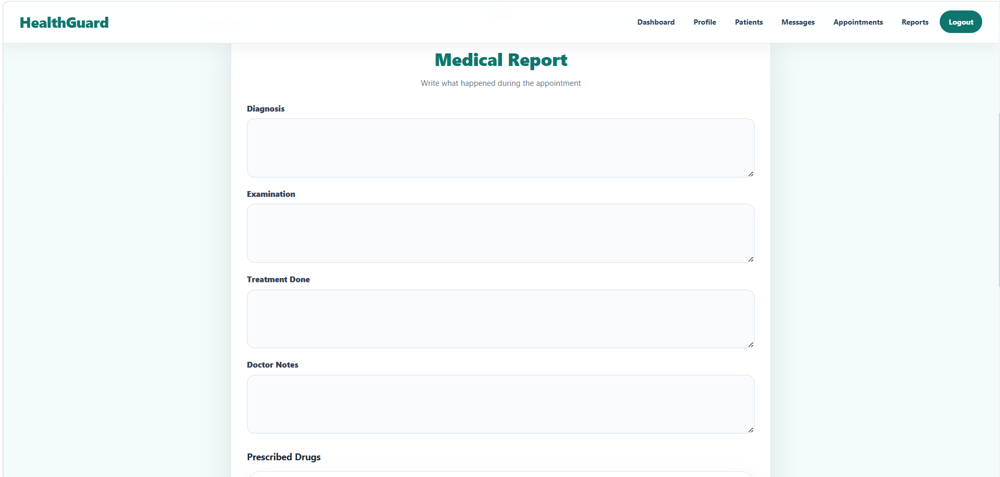
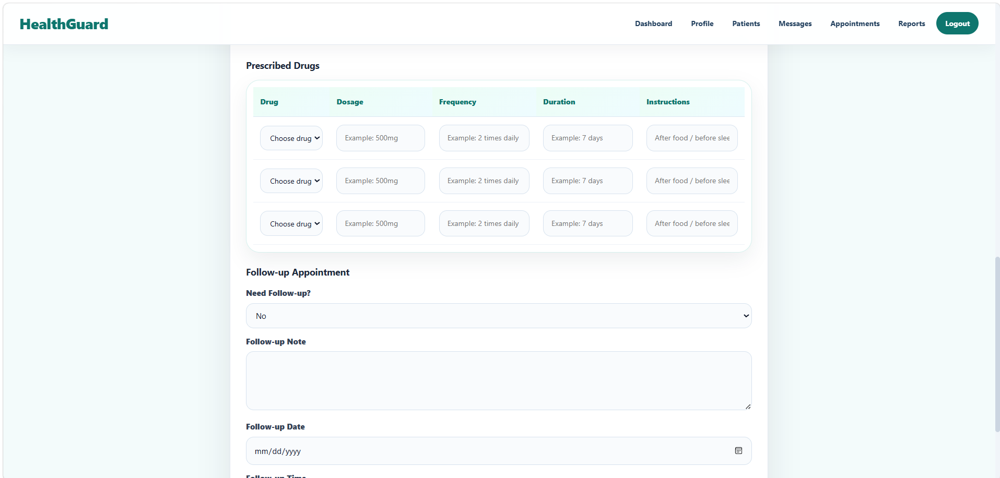
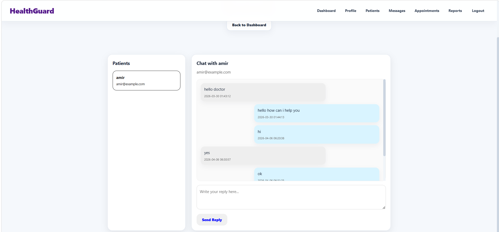
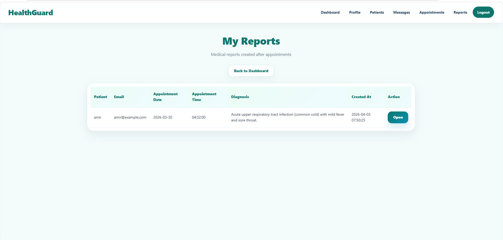

---

###  Patient Panel

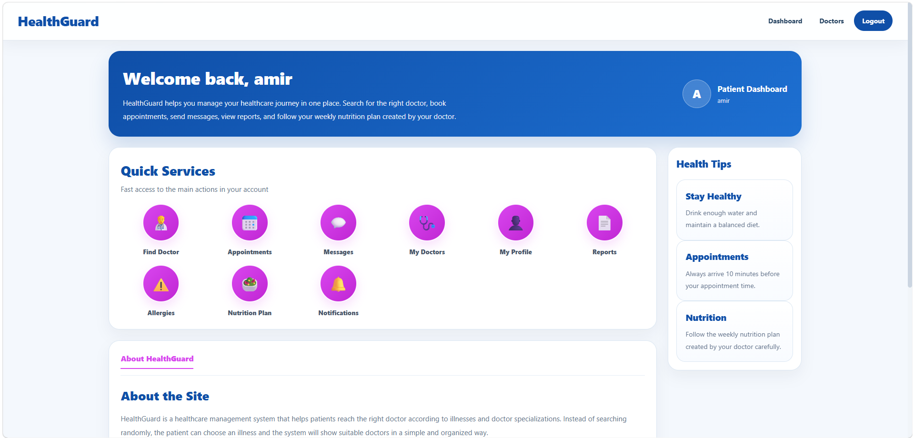
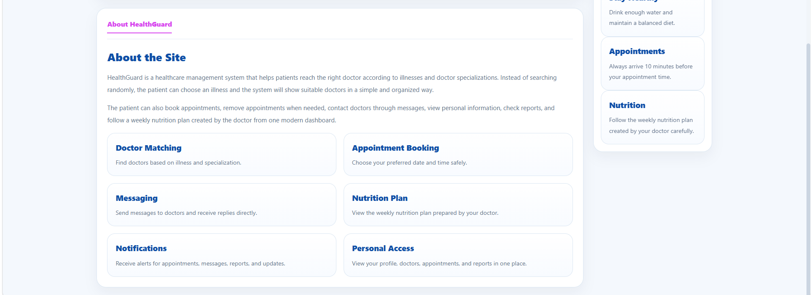
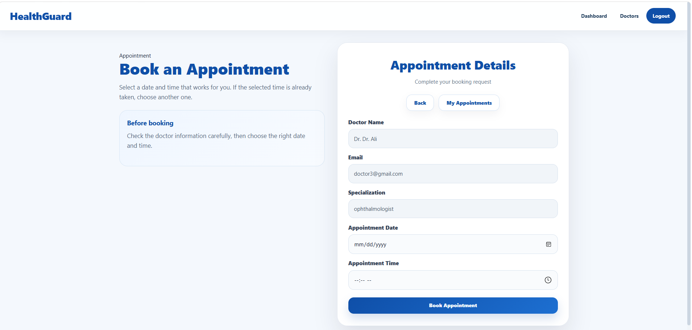
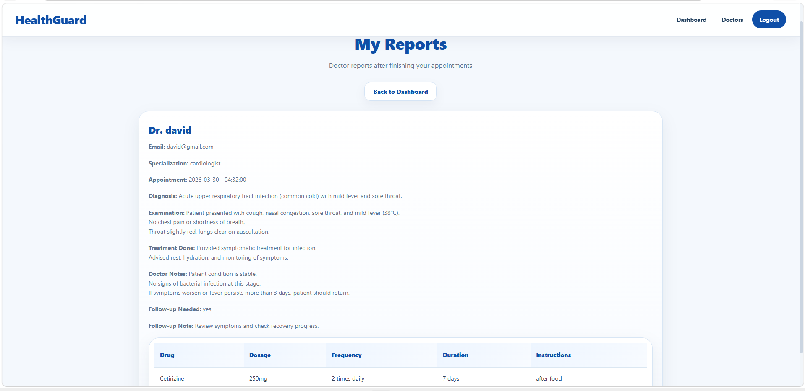
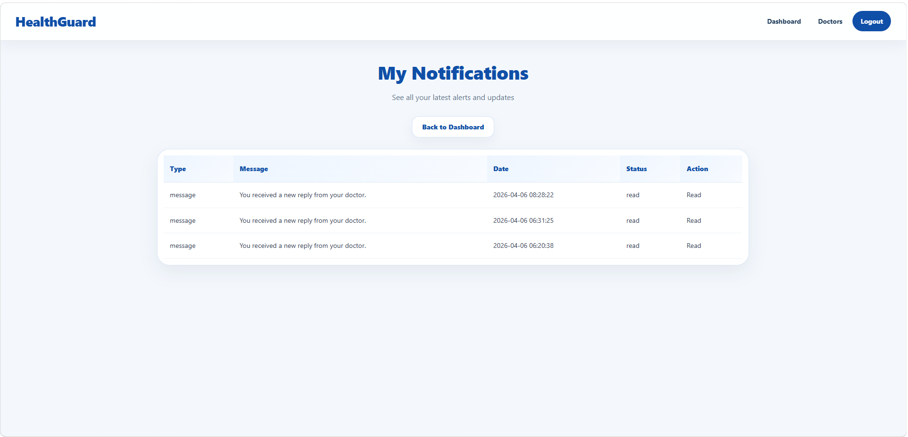
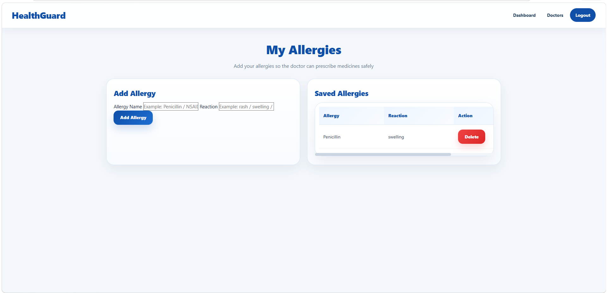

---

###  Database Design

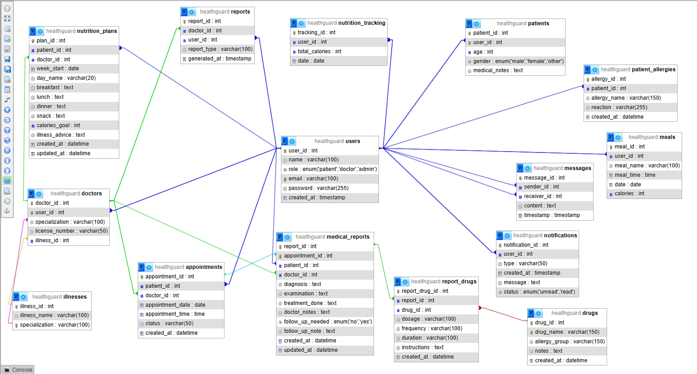

---

##  Technologies Used

* PHP
* MySQL
* HTML
* CSS
* WAMP / XAMPP
* Visual Studio Code

---

##  How to Run the Project

1. Install WAMP or XAMPP
2. Move the project folder to:

```
wamp64/www/
```

or

```
xampp/htdocs/
```

3. Start Apache and MySQL

4. Import the database:

```
database/healthguard.sql
```

5. Open in browser:

```
http://localhost/HealthGuard/
```

---

##  Current Limitations

* Some features are still under development
* UI improvements are planned
* No live deployment yet (runs locally)

---

##  Project Highlights

* Role-based system (Admin / Doctor / Patient)
* Full database integration
* Real-world healthcare scenario
* Organized backend structure
* Multiple working system pages

---

##  Author

Mohammad Bakri
Software Engineering Student

---

##  Notes

This project is part of my learning journey and is continuously being improved.
